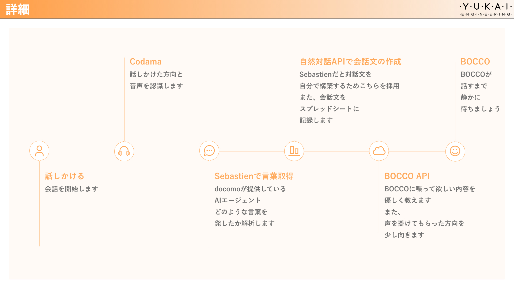

# この記事について

ユカイ工学春のインターンシップに参加した際に作成したものとなります。[参照](https://www.wantedly.com/projects/287031)

# 概要

「Codamaを使用したプロトタイプの作成」というテーマを元に作成をしました。
自分が作った作品は「Codamaを通してBOCCOと対話をする」という作品を作成しました。

# 構成



# Codamaとは

[ここ](https://github.com/yuma1100/codama-doc)を参考にしてください

# 初期設定

[ここ](https://github.com/YUKAI/codama-doc/wiki)を参考にしてください。

Sebastienのサンプルコードを引用して作っています。

開発環境はpython3.5系です

```
$ pip3 install uuid
$ pip3 install bocco
```

のインストールをお願いします。
uuidはboccoAPIを使用し、テキストをルームに送る際に使います。

# boccoとは
[ここ](http://www.bocco.me/)を見てください。
API発行は[ここ](http://api-docs.bocco.me/)です。
仕様は[こちら](https://github.com/YUKAI/bocco-api-python)です。

# プログラムの実行

```
$ cd /home/pi/codama/codama-doc/sebastien/example_it
$ python3 main.py
```

これで実行されます。
プログラムを終了する際には Ctrl + C で強制終了してください。


## 引用元会社

[ユカイ工学株式会社](https://www.ux-xu.com)

